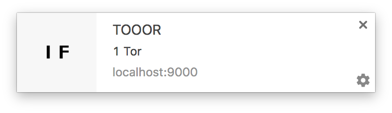

# InstantFeed - ein Newsticker mit Websockets und Notifikationen
# Einführung
In meiner Projektarbeit an der Hochschule Karlsruhe habe ich einen Newsticker programmiert, der als Referenz für den Einsatz von *neuen* Technologien. Dazu werden neue Nachrichten über Websockets an den Browser des Benutzers geschickt. Damit auch keine dieser Nachrichten verpasst werden, zeigt das Betriebssystem eine Benachrichtigung an.  
Da die Nachrichten ohne Verzögerung an den Nutzer weitergeleitet werden, wird die Webapplikation *InstantFeed* genannt.

Dabei habe ich mich um die Probleme gekümmert, die mich am meisten gestört haben. Ich nutze den Ticker von www.kicker.de um dort Fußballspiele zu verfolgen. Dabei sind Tuniere wie der DFB Pokal und auch Ligaspiel in meinem Interesse. Oftmals finden dabei mehrere Spiele gleichzeitig statt.

# Technologien
InstantFeed ist eine Client-Server Anwendung. Der Server ist dabei für die persistierung und Abfrage der Daten zuständig. Eingesetzt wird dazu ein Express web server. Dieser ist in Javascript geschrieben und läuft in Node.js. Die Daten speichert Express in der NoSQL Datenbank MongoDB. Auf der Frontendseite kommt AngularJs zum Einsatz.

## Probleme von herkömmlichen Newstickern
Viele Webseiten werden heute noch als statische Webseite ausgeliefert, die nach dem laden keine weitere Interaktion mit dem Server vornimmt. Dabei wird man oft nicht über neue Nachrichten in einem Feed informiert. Somit ist ein neuladen der Webseite nötig um diese auf Neuerungen zu überprüfen.  
Durch das ständige laden einer Webseite werden neben den neuen Daten auch viele alte Daten erneut vom Server abgefragt und geladen. Dieser Vorgang erhöht die Netzauslastung unnötig.

Bei mehreren parallelen Spielen müssen die verschiedenen Feeds in unterschiedlichen Tabs geöffnet werden. Die Mögichkeit mehrere, ausgewählte Feeds in einen zu Mischen ist auch nicht gegeben. Das Problem der unnötig geladen Daten ist dabei für jeden einzelnen Tab vorhanden. Somit multipliziert sich das Problem für jeden Feed der vorfolgt werden soll.  
Durch mehrere Feeds in verschiedenen Tabs sind gegebenfalls Tabs im Hintergrund und Änderung in diesen werden verpasst. Dies kann soll durch ein Benachrichtigung des Betriebssystem gelöst werden.


## Lösungen
Die Lösungen für die Probleme aus dem letzten Abschnitt werden im Folgenden erläutert. Dabei wird immmer die Blickwinkel von der Webapplikation InstantFeed aus sein. Zuerst werden Websockets erklärt. Dann werden die Desktopnotifikationen erklärt. Zum Abschluss gehe ich auf die personalisierte Feeds eingehen.

### Websockets
Wird eine Webseite im Browser aufgerufen, fragt der Browser alle Resourcen bei dem entsprechenden Server ab. Wurden alle Anfragen beantwortet kann der Server keine weiteren Daten an den Browser schicken. Aller Datenverkehr zwischen Browser und Server muss vom Browser initialisiert werden. Um neue Daten vom Server zu bekommen, nachdem die Webseite geladen wurde, gibt es zwei Möglichkeiten.  
Eine Möglichkeit besteht darin, periodisch in bestimmten Zeitabständen eine neue Abfrage beim Server zu machen. Bei neuen Daten werden diese geladen, jedoch entsteht durch die die vielen Abfragen ein unnötige Last auf dem Server und dem Netzwerk.  
Die andere Möglichkeit ist das sogenannte *long polling*. Bei long polling wird vom Browser eine Anfrage an den Server gestellt, welche nicht sofort beantwortet wird. Die Verbindung wird so lange aufrecht erhalten, bis entweder neue Daten beim Server ankommen oder die Maximalzeit überschreitet und unterbrochen wird. Auch hierbei wird die Last auf dem Server, durch viele offene Anfragen, erhöht.  
Alle der bisher beschriebenen Anfragen laufen über HTTP(S), dem eine TCP Verbindung zugrunde liegt.

Auch bei Websockets wird die Verbindung vom Client initialisiert, jedoch nicht nach Datentransfer abgebaut. Über diese bidirektionale Verbindung kann in beide Richtungen, Client zu Server und Server zu Client, Daten geschickt werden.

Bei InstantFeed wird eine Websocketverbindung zum Server aufgebaut, wenn der Feed angezeigt wird. Wird eine neue Nachricht an den Server geschickt, wird nach dem Speichern die Nachricht über den Websocket verschickt. Die Variable `doc` enthält dabei die gespeicherte Nachricht als Javascriptobjekt.

```javascript
exports.register = function(socket) {
  Message.schema.post('save', function (doc) {
    onSave(socket, doc);
  });
}
function onSave(socket, doc, cb) {
  socket.emit('message:save', doc);
}
```

Auf dem Client wurde eine Funktion vorbereitet, die Nachrichten über Websockets verarbeitet. Diese Funktion hat einen Identifier für die Nachrichten, das Array, welchem die Nachricht hinzugefügt wir, sowie eine Callbackfunction übergeben bekommen.  
Der Identifier ist nötig, da nicht nur Nachrichten, sondern alle Daten die syncronisiert werden über den gleichen Websocket geschickt werden. Wir wollen hier aber nur die Nachrichten, weshalb wir diese Filtern.  
Das Array ist im Beispielcode `array` genannt. Zuerst wird überprüft, ob sich darin bereits ein Objekt befindet mit der gleichen `id`. Besteht ein Objekt mit dieser `id` wird dieses ersetzt, ansonsten wird das neue Objekt hinzugefügt.  
Am Ende wird die übergebene Callbackfunction ausgeführt.

```javascript
socket.on(modelName + ':save', function (item) {
  var oldItem = _.find(array, {_id: item._id});
  var index = array.indexOf(oldItem);
  var event = 'created';

  // replace oldItem if it exists
  // otherwise just add item to the collection
  if (oldItem) {
    array.splice(index, 1, item);
    event = 'updated';
  } else {
    array.push(item);
  }
  cb(event, item, array);
});
```

In InstantFeed wird nur die Nachricht über Websockets geschickt. Die Nachricht hat jeweils eine Referenz auf die zugehörige Topic und gegebenfalls auf ein Bild. Die Topic und das Bild werden wiederum per HTTP(S) Anfrage vom Server geladen. Da diese jetzt keine unnötigen Anfragen gemacht werden und besonders bei Bildern der Overhead von HTTP(S) relative nicht so groß ist.


### Notifications

Desktopnotifikationen sind Benachrichtigungen, welche vom Browser initialisiert und vom Betriebssystem angezeigt werden. Dadurch muss der Browser nicht im Vordergrund laufen und trotzdem wird der Benutzer benachrichtigt. Trotzdem muss der Browser die Webapplikation geöffnet haben.  
Wenn zum ersten Mal eine Benachrichtigung des Browsers geschickt werden soll, wird der Nutzer gefragt, ob er diese zulassen will. Das erste nachfolgende Bild ist von Kubuntu, das zweite unter OSX aufgenommen.




Eine Notification zeigt das Icon der Webapplikation und deren Url an. Außerdem die Überschrift und der Anfang des Textes der neuen Nachricht. Nach 10 Sekunden verschwindet die Benachrichtigung automatisch wieder.

Für die Notifications wird die Bibliothek *angular-web-notification* verwendet. Damit muss die Funktion `showNotification` auf dem Objekt `webNotification` aufgerufen werden. Darin wird als erster Übergabeparameter die Überschrift der benachrichtigung übergeben.  
Der zweite Parameter ist eine Objekt mit Einstellungen für die benachrichtigung. Das Attribut `body` enthält den Text, der in der Benachrichtigung angezeigt wird. 'icon' ist das Icon, welches am linken Rand angezeigt wird. Die Funktion `onClick` wird ausgeführt, wenn die Benachrichtigung angeklickt wird. In diesem fall wird dabei der Tab, der die Benachrichtigung geschickt hat in den Vordergrund geholt. In `autoClose` wird angegeben, nach wie vielen Millisekunden die Benachrichtigung wieder geschlossen wird.  
Der dritte Parameter ist eine Funktion die ausgeführt wird, wenn die benachrichtigung angezeigt wird. In dieser werden die Fehler behandelt.

```javascript
function notify(message) {
  webNotification.showNotification(message.headline, {
    body: message.text,
    icon: 'favicon.ico',
    onClick: function onNotificationClicked() {
      $window.location.hash = message._id;
      $window.focus();
    },
    autoClose: 10000
  }, function onShow(error) {
    if (error) {
      alert('Unable to show notification: ' + error.message);
    }
  });
}
```
Unterstützt werden Benachrichtigung von Chrome und Firefox. Jedoch von keinem mobilen Browser.

### User defined Feeds
* Abfrage zu topics
* Clientseitige filter vor Websocket Nachrichten
* Speicherung im Local Storage

## Fazit

Mit Websockets konnten sowohl unnötige Anfragen an den Server verhindert werden, als auch die Netzauslastung verringert werden, da direkt auf TCP kommuniziert wird.

## Ausblick
* Eingehende Nachrichten
* Notifications einstellbar

## Anhang
https://github.com/KordonDev/InstantFeed  
https://nodejs.org/  
expressjs.com  
mongoosejs.com  
https://angularjs.org/
